# Chi Face Fight

A self-contained face-fighting game for an ESP32-S3 camera board and a
240 x 280 touch LCD. The reference build uses a Seeed Studio XIAO ESP32S3 Sense
and a Waveshare 1.69-inch ST7789V2 touch LCD.

The OV3660 camera detects and captures one face locally. Camera acquisition and
face inference then stop for the entire fight. The captured face becomes a
transparent, moving opponent while Secretary Chi walks, punches, kicks, dodges,
blocks, gets hit, and celebrates using pixel-art sprite animation.

<p align="center">
  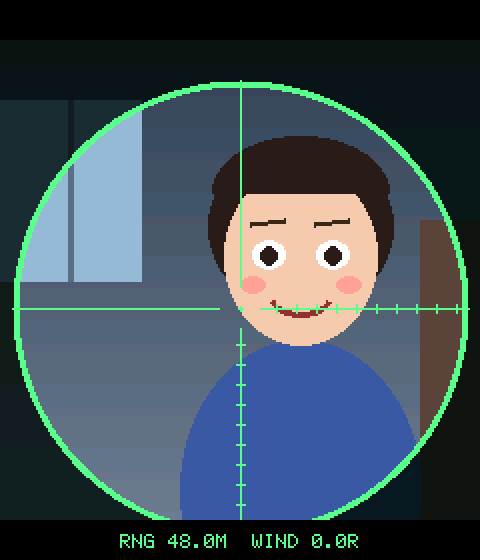
</p>

## Screenshots

| Find face | Lock on | Intro | Attack | Warning |
|:-:|:-:|:-:|:-:|:-:|
| 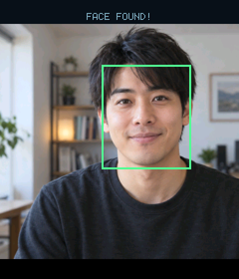 | 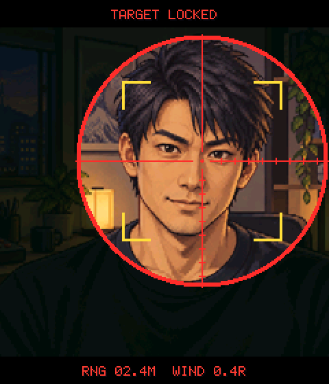 | 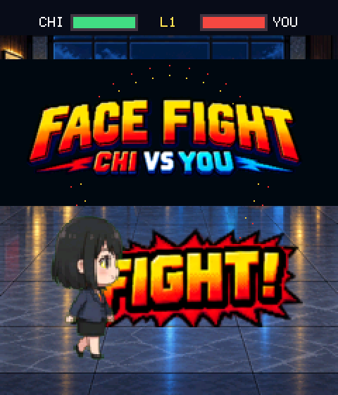 | 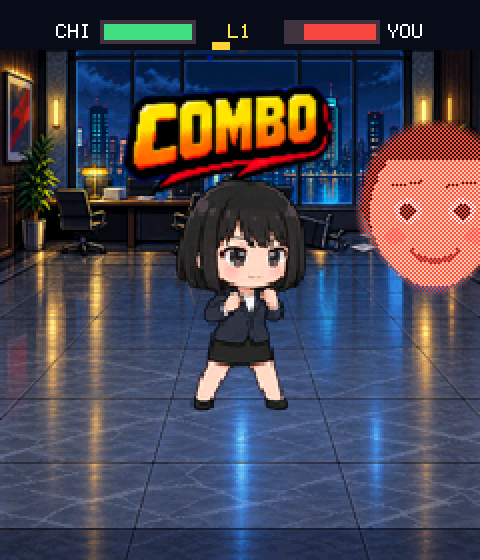 | 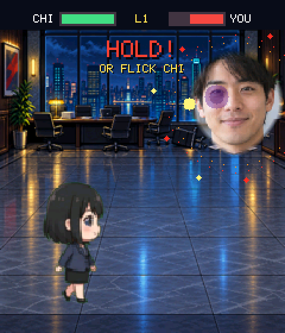 |

| Flick dodge | Weak point | Critical | Chi wins | Face wins |
|:-:|:-:|:-:|:-:|:-:|
| 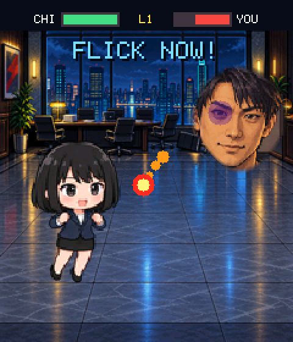 | 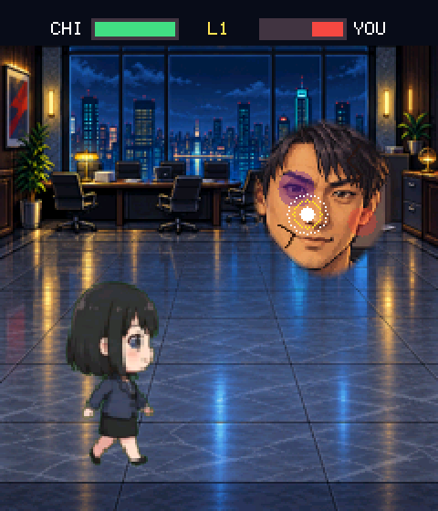 | 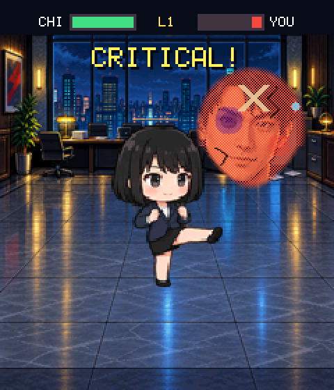 | 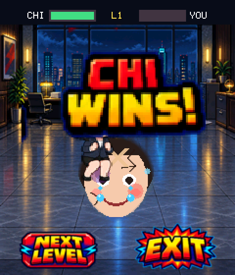 | 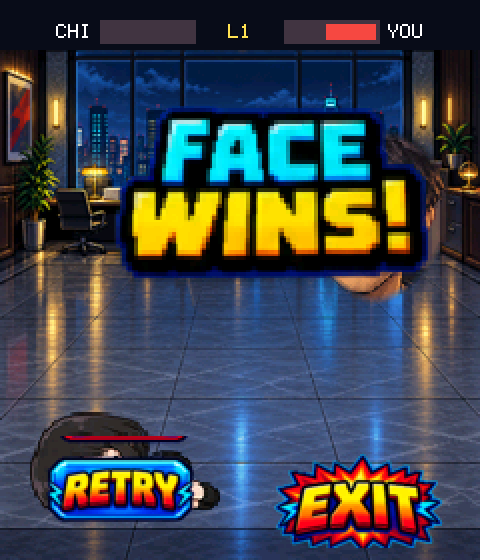 |

These screenshots are rendered by the firmware's own drawing code compiled on
the host (see [Regenerating screenshots](#regenerating-screenshots)); the
opponent is a synthetic cartoon face, not a real person.

## Game flow

1. Find a face with the on-device ESP-DL detector. The preview is mirrored like
   a selfie camera.
2. A sniper scope locks onto the captured face and fires; the portrait is cut
   out with a feathered head silhouette.
3. Play a title sequence and enter the office or rooftop arena.
4. Fight until one side reaches 0 HP.
5. Win to continue to a harder level, or exit to restart the camera and find a
   new face.

The firmware uses no Wi-Fi, cloud service, or microSD storage.

## Controls

| Input | Effect |
|---|---|
| Tap the face | Queue an attack. Chi walks into range; every third landed hit is a kick. |
| Tap the glowing weak point | The next hit is a critical (damage x2 + 2). |
| Hold Chi | Guard. Blocked hits deal only chip damage. |
| Flick from Chi | Dodge: flick up to jump, any other direction to side-step. |
| Flick just before impact | Just dodge: Chi counter-attacks with a critical. |

## Combat

| | Damage |
|---|---|
| Punch / kick | 7 / 12 (critical 16 / 26) |
| Boss orb, unblocked / blocked | 14 / 2 |
| Boss body charge (level 2+), unblocked / blocked | 18 / 4 |

- Boss HP grows by 12 per level (max 180). Warnings get shorter, attacks come
  faster, feints appear from level 3, and the face dodges around from level 4.
- The opponent's face shows a bruise at 70% HP, cracks at 45%, and a bandage at
  20%.
- Full rules and the state machine live in
  [docs/FACE_FIGHT_GAME.md](docs/FACE_FIGHT_GAME.md).

## Hardware

### Requirements

- **ESP32-S3** with at least 8 MB flash and 8 MB PSRAM. The ESP-DL face model
  ships for ESP32-S3 (and P4); classic ESP32 and C-series chips are not
  supported. The firmware image is about 5.8 MB.
- **DVP camera** supported by `esp32-camera`, such as OV3660 or OV2640.
- **240 x 280 ST7789 LCD with a CST816 touch controller**. The layout is
  written for this resolution.
- A microphone is not needed; the PDM microphone is initialised but unused in
  gameplay.

### Reference build

- Seeed Studio XIAO ESP32S3 Sense (OV3660 camera, 8 MB octal PSRAM)
- Waveshare 1.69-inch Touch LCD Module, 240 x 280, ST7789V2 + CST816T

| Signal | XIAO GPIO |
|---|---|
| LCD SPI MOSI / SCK / CS / DC / RST / BL | 9 / 7 / 2 / 4 / 1 / 43 |
| Touch I2C SDA / SCL / RST / IRQ | 5 / 6 / 44 / 3 |
| Camera | XIAO Sense on-board connector |

### Porting to another ESP32-S3 board

Only the reference build has been tested. To try another board:

1. Update the pin map in `include/board_pins.h` (camera, LCD, touch).
2. Set `board` in `platformio.ini`, and the flash size and PSRAM mode in
   `sdkconfig.defaults` (`CONFIG_SPIRAM_MODE_OCT` is for octal PSRAM).
3. Check the camera orientation in `start_camera()` in `main/main.cpp`. The
   preview is mirrored on every sensor, but the vertical flip is only applied
   to OV3660, which is how the XIAO Sense module is mounted.
4. For a different panel, adjust `init_lcd()` (mirroring, colour inversion and
   the 20-pixel row gap of the 1.69-inch module).

## Build

Install PlatformIO, connect the XIAO by USB, then run:

```sh
pio run
pio run --target upload --upload-port /dev/cu.usbmodem101
pio device monitor --port /dev/cu.usbmodem101 --baud 115200
```

Without a PlatformIO install, prefix the commands with
`uvx --from platformio`, for example `uvx --from platformio pio run`.
Replace the serial device path when macOS assigns a different port.

The serial log reports gameplay as `FIGHT_EVENT`, `FACE_EVENT`, and
`TOUCH_TRACE` lines, which is the quickest way to check input and balance on
the device.

## Regenerating screenshots

```sh
uv run --with pillow python tools/screenshots/render_screens.py
```

The script compiles `main/main.cpp` with its hardware functions stripped out
(`tools/screenshots/host_stubs.h` stands in for ESP-IDF), plays scripted scenes
through `tools/screenshots/host_main.cpp`, and writes `docs/images/`. It needs
`clang++` and `uv`.

## Project structure

- `main/`: firmware and generated sprite/UI/background arrays
- `assets/`: source sprite sheets, previews, and animation preparation tools
- `tools/`: reproducible UI asset generation and host screenshot rendering
- `components/`: local ESP-DL model component
- `docs/`: game design notes and README images
